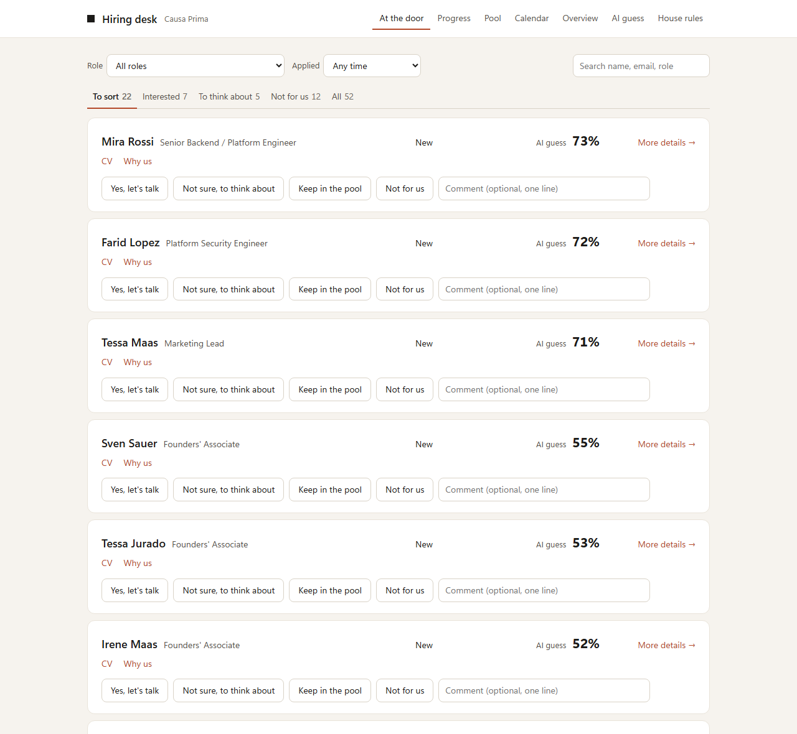
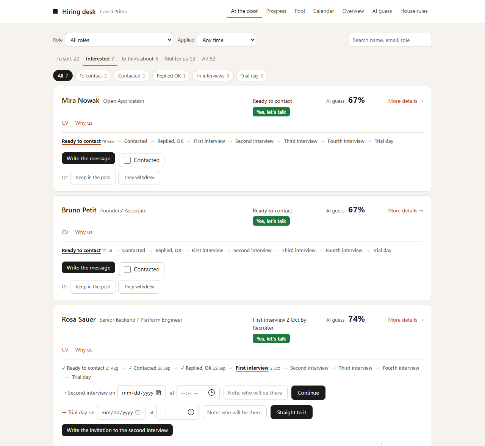
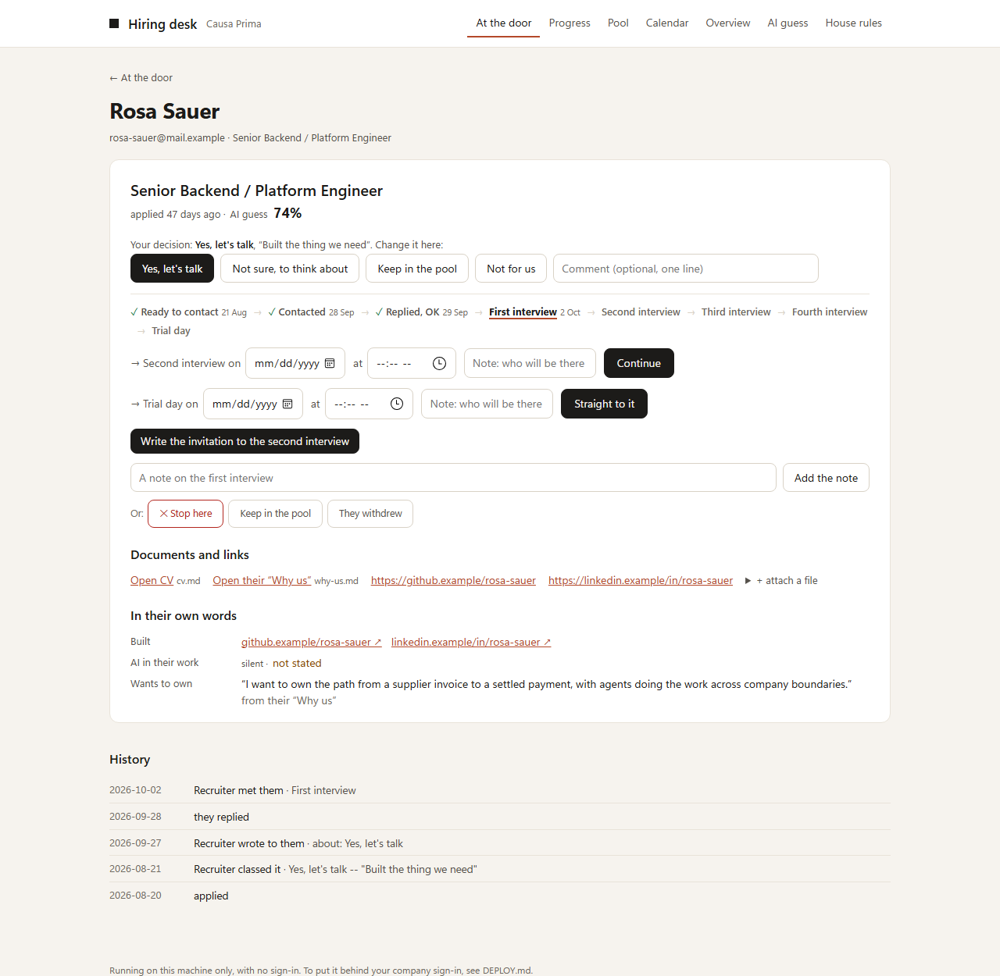
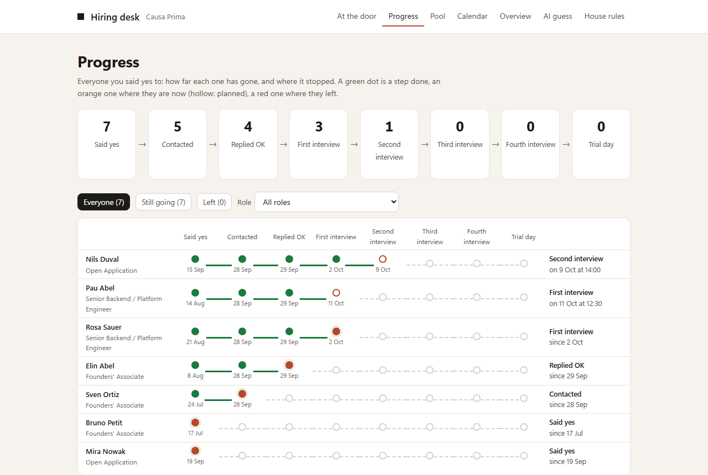
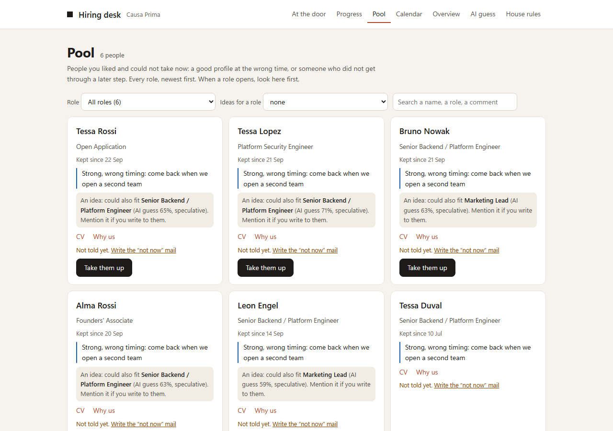
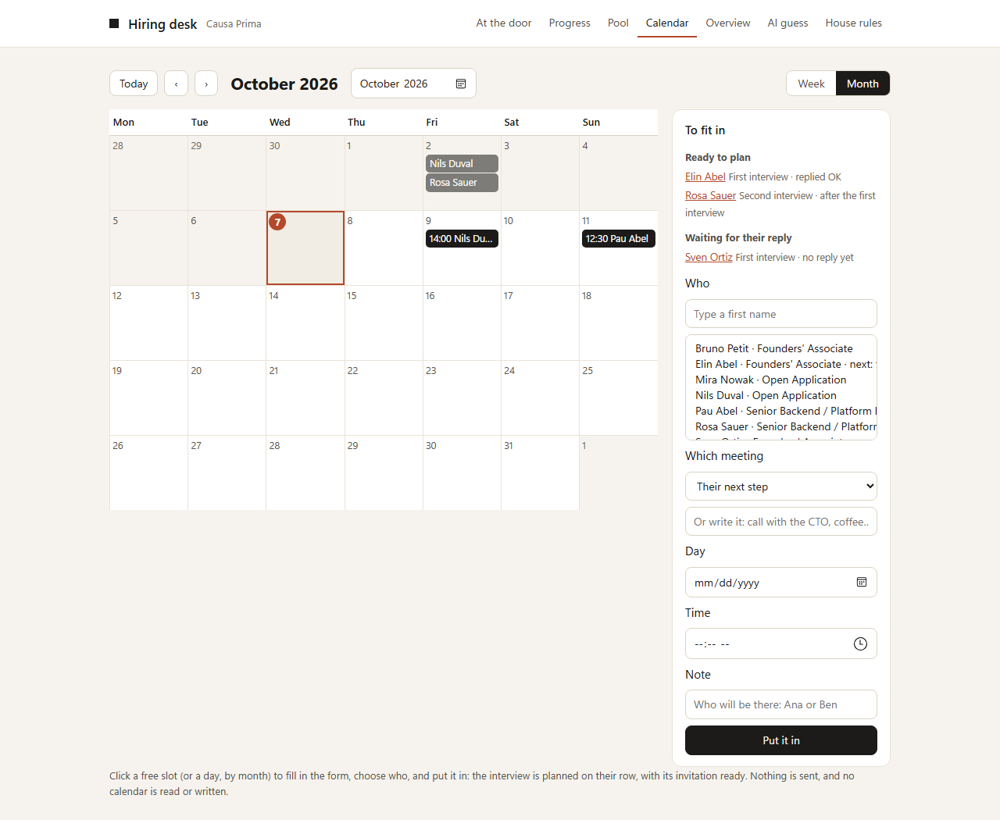
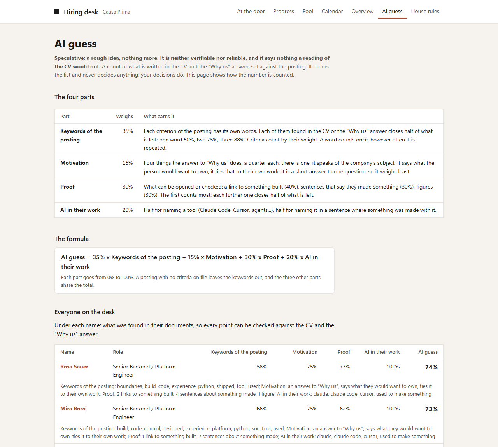
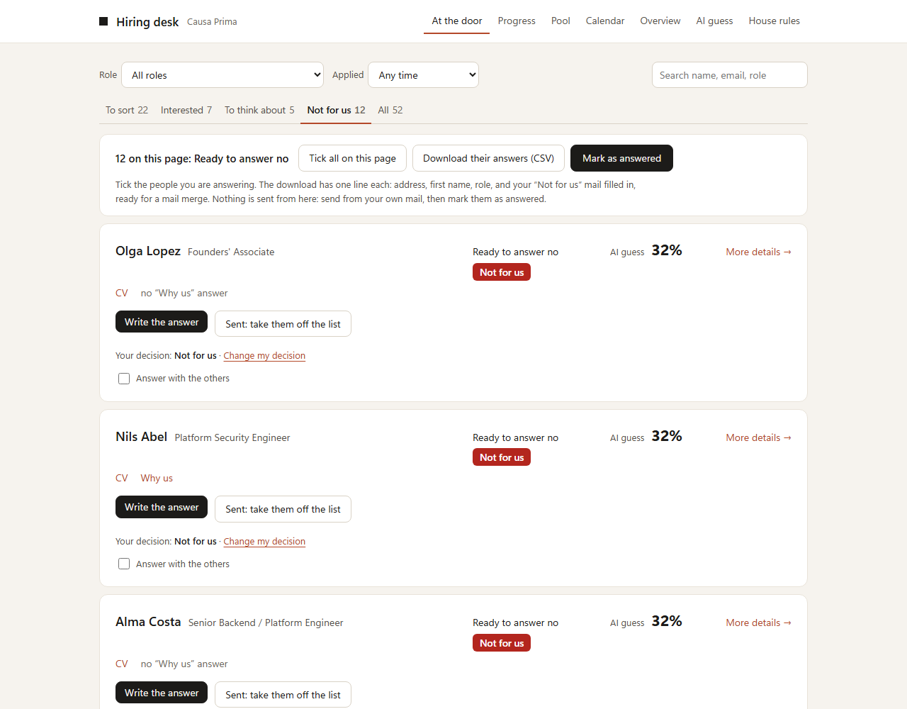

# Hiring desk

A hiring desk for the person who reads every application, when hundreds of
them arrive each month. It sits under a careers page that promises an answer
to everyone: everyone who applies gets a decision, a clear state, and an answer.

It runs on a laptop, calls no AI model, sends nothing by itself, and every
word and rule in it can be changed.

## Try it in two minutes

**Download it.** On this page: **Code → Download ZIP**, then unzip it.

**The easy way, with Claude Code.** Open the unzipped folder in Claude Code
and ask: *"Show me the demo, then install this hiring desk on my computer."*
It reads its own manual, [CLAUDE.md](CLAUDE.md), shows each step and asks
before doing anything.

**By hand.** It needs a recent Python: on Windows from python.org, ticking
*Add python.exe to PATH*; on a Mac from python.org or Homebrew, because the
Python that comes with macOS is too old. Then, in a terminal opened in the
unzipped folder:

    # Python 3.11 or later

    # macOS
    python3 -m venv .venv
    .venv/bin/pip install -r requirements.txt
    .venv/bin/python desk.py serve

    # Windows (PowerShell)
    py -m venv .venv
    .venv\Scripts\pip install -r requirements.txt
    .venv\Scripts\python desk.py serve

    # then open http://127.0.0.1:8765 ; closing the terminal stops it

Open the page and sort. The five applicants are invented,
and their links use the reserved `.example` domain. Adding a real one takes a
name, a CV and a link: `+ Add an application by hand` at the bottom of the
list. For real use, see [Install it for real use](#install-it-for-real-use):
a separate copy with empty data, a launcher on the Desktop, and a backup
every evening.

## How it works

- **Applications arrive.** From Ashby, from a CSV file, or added by hand with
  a name, a CV and the answer to "Why us?".
- **A single person sorts them.** The list comes a page at a time, the best
  AI guess first. Each row carries the CV, the answer to "Why us?" and the
  choices: **Yes, let's talk**, **Not sure, to think about**, **Keep in the
  pool** or **Not for us**. A click is the decision, and each has its colour
  on the list: green, orange, blue, red.
- **The decision puts the application in a phase, each with its tab.** Yes:
  *Interested*. Not sure: *To think about*. Kept: *In the pool*. No: *Not for
  us*. The tabs follow that order, from *To sort*, what has just arrived.
- **On *Interested*, each person is followed on their own row**, from the
  first message to the trial day: *Ready to contact → Contacted → Replied, OK
  → First interview → … → Trial day*, each step done with its date, and below
  it what to do now. Write the message, then tick *Contacted*; tick
  *They replied: OK*; plan the interview with its day and time; keep notes on
  it; then an arrow to the next interview, or *Stop here*.
- **Stopping is a no like any other.** The person moves to *Not for us*, where
  their answer is ready; when it is sent, they leave the list.
- **The pool is for people you like and cannot talk to now**: a good profile
  at the wrong time, or someone who did not get through a later interview.
  It takes a click, with no date. They stay in the pool, in their own tab,
  until you take them up again. A date to come back to them can be required
  in the settings.
- **A person writes, the desk prepares the draft.** For each situation there
  is a mail draft, opened in your own mail app, from your own address.
- **A no is answered too, and many can be answered together.** Tick the
  people, download their mails already filled in (a CSV file, ready for a mail
  merge), send them from your own mail, then mark them all as answered in a
  click.
- **Every step is a click by a named person**: Contacted, Replied, each
  interview, Trial day. How many interviews come before the trial day is a
  setting, and each has its own name. The trial day is the last step: what
  follows (an offer, a hire) is another process. Notes on each application
  stay available, for example for a recap after the trial day.
- **An overview, for information.** How many people applied to each role, and
  how far they went: whole numbers, nothing that says hurry.

Nothing is decided by the machine. There is no "reject" state, no threshold,
and no application is ever hidden.

A person can be erased on request, everything about them in every role, from
their page; applications past the retention period are listed on **House
rules**, and a person erases them. Only a line without their name says that
an erasure was made.

A team can use the same desk: with several names under "who decides", the same
click becomes a vote, cast without seeing the others', and the application
goes to *Team to decide* when the votes differ.

## The pages

| Page | What it is for |
|---|---|
| **At the door** | The applications, a page at a time, by phase. Tabs: *To sort*, *Interested* (each person followed step by step, filtered by the step they are at, and a button to check Outlook for replies when that option is on), *To think about*, *Not for us* (each answer ready, with the tools to answer several together) and *All*: everyone who ever applied, decided or not, closed or not, with each decision in its colour. Above the tabs, the role and the period they applied in narrow any of them. A team sees the tabs of a team: its votes, then the states. |
| **Progress** | Everyone said yes to: a funnel from the yes to the trial day with how many left at each step, then a line per person, a dot for each step reached with its day. |
| **Pool** | People kept for later, every role together: why they were kept and how far they had gone, whether they were told, ideas of other roles their papers fit (speculative, never applied by itself), and a button to take them up again. |
| **Calendar** | A month or a week of interviews, for the person who runs hiring: every interview and trial day at its day and time, and beside it the people to fit in (replied, or going on after an interview). Click an empty slot, choose who, and the interview is planned on their row. Each planned meeting has an *Add to Google Calendar* link that opens Google's own page filled in; no calendar is read or written by the desk. |
| **More details** (a person) | The state and the next step, the decision, the mail draft, the CV and the "Why us" answer, notes, and sentences copied from their own documents: what they built, AI in their work, what they want to own, their current role. The desk never rephrases anyone. |
| **Catch-up** (teams only) | What is waiting on each voter, with a link beside each application that decides in a click. Not in the menu when a single person decides: the list by role says it all. Opening a link never decides; it asks first, because mail scanners open links too. Empty sections are left out. |
| **Overview** | For information: how many applications, roles, decisions, yeses and interviews, then a table of counts per role: applied, decided, said yes, contacted, replied, each interview, trial day, in the pool, answered no. |
| **AI guess** | How the percentage beside each name is counted, and everyone's numbers with what was found in their documents. |
| **House rules** | Every word and every rule: the names of the buttons and the choices offered, how many interviews, each mail and whether it is used. Beside it, the same settings as *guided questions*, and a *Check* that everything is in order. |

## The percentage beside a name

It is called **AI guess**, and it is arithmetic: a count of what is written in
the CV and the "Why us" answer, set against the posting. No model is called,
and the same documents always give the same number.

    AI guess = 55% x what the posting asks for
             + 20% x proof
             + 15% x AI in their work
             + 10% x motivation

- **What the posting asks for.** Each criterion is read from the posting's own
  sentence, and a word counts by how specific it is to the role: a word every
  posting uses earns nothing. When a criterion names something only this role
  asks for (a language, a database, a background in consulting or banking) and
  none of it is in the documents, the words around it do not meet it. A
  requirement the posting itself calls hard, with nothing found, holds the
  number down, and the page says why. Where the posting asks for years in a
  field, the dated jobs of the CV in that field are added up and set against
  them; a CV with no dates is held lower, and says so. An open application
  has no posting to compare to, and is read on the other parts only.
- **Proof.** What can be opened or checked: a link to something built,
  sentences that say they made something, figures.
- **AI in their work**, the one hard requirement: a tool named, and a tool
  named in a sentence where something was made with it.
- **Motivation.** What the short answer to "Why us?" does: it exists, it
  speaks of the company's subject, it says what the person would want to own,
  and it ties that to their own work.

The **AI guess** page shows, under each name, the words and the items that
were found, so every point can be checked against the documents.

It orders the list and nothing more. It counts words on paper: someone who did
the thing and did not write it down scores low, and the posting's words are
English, so a CV in another language scores low on keywords. Read the
documents.

## The mail drafts

A draft for each step, in a plain professional tone, with the first name, the
role and the company filled in:

- yes: the invitation to a first conversation;
- a single reminder when someone has not replied;
- an invitation for each interview the team runs (the first, the second, the
  third and so on), each with its own words;
- the invitation to the trial day, after the last interview;
- "not now", with their agreement to keep the application;
- a clear and respectful no.

An invitation carries `{day}` and `{time}`: when the meeting is planned on the
desk they are filled in; before that they show as `[day]` and `[time]`, to
fill in by hand. They are examples until the team writes its own on **House
rules**, which shows an invitation for each interview the team actually runs.
The desk never sends anything: it opens the draft in your mail app, and you
send it.

For the people who got a no, the same draft comes filled in for each of them in
a single file, and they are marked as answered together:

## Install it for real use

The demo above runs on invented people. For real use, `install.py` makes a
separate copy with empty data, outside any synced folder (a sync tool can
leave a file "online only", and the desk then cannot read its own data), puts
a launcher on the Desktop, and schedules an evening run (`daily.py`): new
applications from Ashby when that is switched on, then a backup to a folder of
your choice, such as a company drive. The launcher runs it too, at each start:

    python install.py --dry-run --backup-to "<a backup folder>"   # every step, nothing done
    python install.py --backup-to "<a backup folder>"

    python backup.py            # a dated, checked zip of all the data, now
    python check.py             # is everything in order? (also House rules > Check)

[CLAUDE.md](CLAUDE.md) is the operating manual: written for Claude, so that
opened in Claude Code this folder can be installed, kept safe, connected to
Ashby and looked after step by step, with what must never be done.

## Use it as a team, and connect it

[DEPLOY.md](DEPLOY.md) has the detail. In short:

- **Sign-in.** The desk runs in a container behind the company sign-in you
  already have (Google Workspace, Microsoft Entra, Cloudflare Access). Each
  person is recognised by their email; there is no extra password.
- **Ashby.** `ashby.py` brings applications in (the CV, the answer to the
  "why" question, the LinkedIn link), on demand or as they arrive, and can
  write the agreed outcome back as a private note. It was built from Ashby's
  published API and has never yet run against a live account: the first
  connection is to be done together.
- **Outlook, an option, off by default.** `outlook.py` looks in the mailbox of
  the person who runs hiring for replies from the people written to, when
  someone presses *Check Outlook for replies*: only those people, only the
  time of the reply and a link, never the text of a mail, and never a tick in
  their place, since a reply can be a no. It needs a registration by the
  company's Microsoft admin, and a sentence in the privacy notice candidates
  receive: [docs/OUTLOOK.md](docs/OUTLOOK.md). It has never run against a live
  account. A team on Gmail needs the same thing built for Google, not built
  yet.
- **Your words and rules.** `desk.toml`, or the **House rules** page: who
  decides, the names of the buttons, the interviews, the mail drafts, your
  logo.
- **Cost.** Nothing by default: no model is called. Mail drafts written by AI
  are an option, off by default; when on, candidates' documents go to the
  model provider, so decide that before the first real CV.

What the desk defends against, and what it does not, is in
[docs/SECURITY.md](docs/SECURITY.md).

## What is in the repository

| Where | What |
|---|---|
| `desk.py`, `console/` | The desk: applications, decisions, states, pages. |
| `stages.py`, `pipeline.py` | The states and the log. Nothing is edited in place: every vote and step is an event with a name and a date. |
| `match.py` | The AI guess: the count described above. |
| `signals.py` | The sentences copied from a person's own documents. |
| `tuesday.py`, `metrics.py` | The Catch-up page and the Overview page. |
| `ashby.py` | The Ashby connector, with the steps of a first connection (`check`, `pull --job`, `verify`). |
| `install.py`, `backup.py`, `check.py` | A real installation on a computer, its backups, and its health check. |
| `erase.py` | Erasing a person on request, and the people past the retention period. |
| `deploy/` | An optional server, behind the company sign-in (not deployed yet). |
| `CLAUDE.md` | The operating manual, written for Claude. |
| `outlook.py` | The optional Outlook connector: "they wrote back", nothing more. |
| `desk.toml` | The team's settings and the mail drafts. |
| `screen.py`, `intake/`, `harness/`, `judge/`, `nbh/` | An optional screener that reads a CV with a model, and the harness that measures how far that reading can be trusted. Not needed to run the desk. |
| `tests/` | The tests: `pip install -r requirements-dev.txt`, then `python -m pytest -q`. No model is called. |

## The optional model screener, and how far to trust it

The repository also holds a screener that reads a CV with a model, criterion
by criterion (`triage.py score`). The desk does not need it and does not show
its number. It is kept with its measurements, because a reading by a model is
only worth what was measured about it. Every number below comes out of this
repository and can be reproduced from it, mostly for free. The detail is in
[docs/DETAILS.md](docs/DETAILS.md).

- **The fit ranking is a measurement only at the top.** Screened three times
  on identical input, two of five places held. Below a 6.6-point gap the
  order is unreliable: screened once each, two people come out the wrong way
  round more than one time in 20.
- **The name test found nothing, and says what it could have missed.** The
  same facts were screened under four names, seven times each. No pair of
  names separates, and the test could not reliably see a gap under 5.8
  points (6.5 with the exact test). That is not a clean bill of health, and it
  is not printed as one.
- **A judge was measured on defects planted on purpose.** It caught 25 of 32.
  On the unaltered exchange it also found a real defect nobody had planted.
  The obvious fix made things worse for candidates, so it was not kept, and
  the defect is documented as open.
- **A CV carrying hidden instructions produced zero facts from them.** The
  same holds for invisible text in a PDF.
- **Every failure found stays found.** There are eight regression cases, each
  shown to fail with its guard removed, and more than 850 tests.

`python -m harness report` recomputes every number above from the records in
`runs/`, for free and without a model, and writes what holds and what does
not to [runs/report/claims.md](runs/report/claims.md).

## What it is not

- It is not a hiring decision. It is a way to reach the trial day without
  losing anyone on the way.
- It is not tested on a real cohort: one posting, invented applicants, a
  handful of days.
- The agent-to-agent exchange in `nbh/` is a **test harness**, not a
  feature. Nobody sends an agent to apply. An invented candidate's agent
  exists to test whether the company side asks the right questions.

Built unprompted, as an open application. If something here is wrong, that is
the more interesting outcome, and I would rather hear it.

MIT licence ([LICENSE](LICENSE)).
